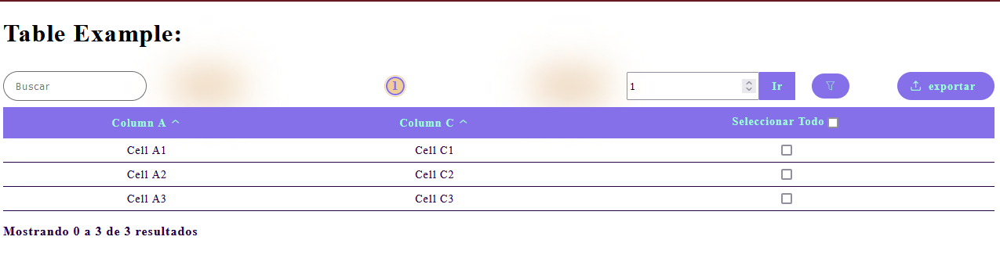
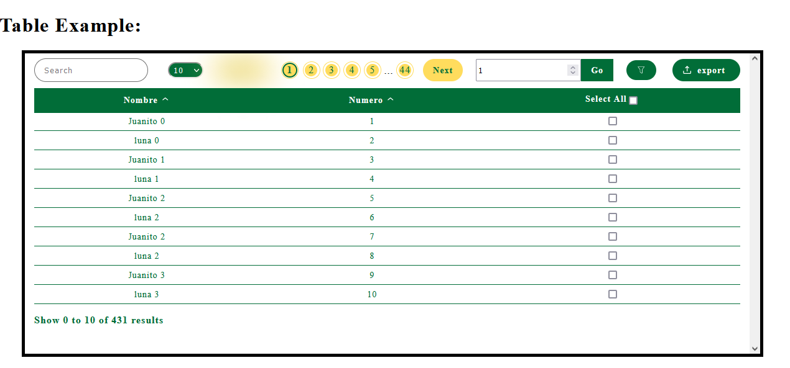

# SupraTables
This library allows to generate a dynamic table with few lines being compatible with applications developed in Google AppScript

    SupraTables is a javascript library that provides an agile and simple way to create dynamic tables that can be integrated even with <cite >AppScript</cite> web projects. With only 4 lines of code you can create a table with all the necessary features for the interaction between users and the desired information.

 
 
<h2 >How to use SupraTables?</h2>

    <ul style="padding-left: 1rem;">
        <li>
            We refer to the supraTables module, in this case using the tag <code><cite > &lt;script src="../src/SupraTables.js"&gt;&lt;/script&gt;</cite></code>
        </li>
        <li>
            We create an instance of SUPRA_TABLES and pass it two parameters: <cite >_mainContainer</cite> which refers to the id of the element that will contain the table, and  <cite >_namedFunction</cite> which identifies the variable or constant that stores SUPRA_TABLES
        </li>
    </ul>
     
     
    
     
     
    This would be sufficient, however SupraTables accepts some additional parameters:

	<table style="border: 1px solid #eee; border-collapse: collapse;">
    	<thead>
    		<tr>
    			<td style="font-size: 19px; padding: 1rem;">Parameter</td>
    			<td style="font-size: 19px; padding: 1rem;">Required</td>
    			<td style="font-size: 19px; padding: 1rem;">Default value</td>
    			<td style="font-size: 19px;text-align: center;">Description</td>
    		</tr>
    	</thead>
    	<tbody>
    		<tr style="border-bottom: 1px dashed #eee;">
    			<td style="padding-right: 1rem;"><cite >_mainContainer</cite></td>
    			<td style="padding-right: 1rem; text-align: center;">Yes</td>
    			<td style="padding-right: 1rem;">N/A</td>
    			<td style=" padding: .7rem 0;">The id of the parent element that will contain the generated table.</td>
    		</tr>
    		<tr style="border-bottom: 1px dashed #eee;">
    			<td style="padding-right: 1rem;"><cite >_namedFunction</cite></td>
    			<td style="padding-right: 1rem; text-align: center;">Yes</td>
    			<td style="padding-right: 1rem;">N/A</td>
    			<td style=" padding: .7rem 0;">A text string containing the name of the variable or constant storing SUPRA_TABLES</td>
    		</tr>
    		<tr style="border-bottom: 1px dashed #eee;">
    			<td style="padding-right: 1rem;"><cite >exportData</cite></td>
    			<td style="padding-right: 1rem; text-align: center;">No</td>
    			<td style="padding-right: 1rem;">true</td>
    			<td style=" padding: .7rem 0;">A boolean value that indicates if we want the user to be able to decide which columns he/she wants to see apart from the ones we specify by default. If set to <i>true</i>, an icon will be displayed to select which columns are shown in the table.</td>
    		</tr>
    		<tr style="border-bottom: 1px dashed #eee;">
    			<td style="padding-right: 1rem;"><cite >checkElements</cite></td>
    			<td style="padding-right: 1rem; text-align: center;">No</td>
    			<td style="padding-right: 1rem;">true</td>
    			<td style=" padding: .7rem 0;">A boolean value indicating whether we want to add an extra column at the end with checkboxes so that users can select one or more rows in the table.</td>
    		</tr>
    		<tr style="border-bottom: 1px dashed #eee;">
    			<td style="padding-right: 1rem;"><cite >maxSpan</cite></td>
    			<td style="padding-right: 1rem; text-align: center;">No</td>
    			<td style="padding-right: 1rem;">5</td>
    			<td style=" padding: .7rem 0;">A number indicating the maximum number of buttons displayed in the table pagination.</td>
    		</tr>
    		<tr style="border-bottom: 1px dashed #eee;">
    			<td style="padding-right: 1rem;"><cite >setNumShowResult</cite></td>
    			<td style="padding-right: 1rem; text-align: center;">No</td>
    			<td style="padding-right: 1rem;">false</td>
    			<td style=" padding: .7rem 0;">A Boolean value indicating whether the user can modify the number of results displayed at the same time on the screen by means of a <i>select</i> element.</td>
    		</tr>
    		<tr style="border-bottom: 1px dashed #eee;">
    			<td style="padding-right: 1rem;"><cite >numShowResult</cite></td>
    			<td style="padding-right: 1rem; text-align: center;">No</td>
    			<td style="padding-right: 1rem;">50</td>
    			<td style=" padding: .7rem 0;">The default number of results displayed on the screen at the same time.</td>
    		</tr>
    		<tr style="border-bottom: 1px dashed #eee;">
    			<td style="padding-right: 1rem;"><cite >locale</cite></td>
    			<td style="padding-right: 1rem; text-align: center;">No</td>
    			<td style="padding-right: 1rem;">'ES'</td>
    			<td style=" padding: .7rem 0;">A text string indicating the language in which the table is displayed. Currently you can select between: <cite >ES</cite>, <cite >EN</cite>, <cite >FR</cite>, <cite >RU</cite></td>
    		</tr>
    		<tr style="border-bottom: 1px dashed #eee;">
    			<td style="padding-right: 1rem;"><cite >styles</cite></td>
    			<td style="padding-right: 1rem; text-align: center;">No</td>
    			<td style="padding-right: 1rem;">N/A</td>
    			<td style=" padding: .7rem 0;">An object that specifies the colors we want to use in our table.</td>
    		</tr>
    	</tbody>
    </table>
     
    
    

    SupraTables provides us with several methods to work with. One of these methods is <cite >initTable</cite> which allows us to initialize the table with the values we pass as properties. InitTable receives two parameters <cite >options</cite> and <cite >...args</cite>. <cite >options</cite> is an object that defines the different properties of our table. It has the following keys:
     
     
    <table style="border: 1px solid #eee; border-collapse: collapse;">
    	<thead>
    		<tr>
    			<td style="font-size: 19px; padding: 1rem;">Property</td>
    			<td style="font-size: 19px; padding: 1rem;">Required</td>
    			<td style="font-size: 19px; padding: 1rem;">Default Value</td>
    			<td style="font-size: 19px;text-align: center;">Description</td>
    		</tr>
    	</thead>
    	<tbody>
    		<tr style="border: 1px dashed #eee;">
    			<td style="padding-right: 1rem;"><cite >columnsToShow</cite></td>
    			<td style="padding-right: 1rem; text-align: center;">No</td>
    			<td style="padding-right: 1rem;">[1,2,3,4,5]</td>
    			<td style=" padding: .7rem 0;">An array containing the numbers of the columns we want to display in our table. 
    				The array can contain both numbers <cite >[1,2,3]</cite> as letters <cite >['A', 'B', 'C']</cite> or a combination of both: <cite >[1, 'B', 3]</cite>. In this case the three arrangements would have the same effect on the table.	
    			</td>
    		</tr>
    		<tr style="border-bottom: 1px dashed #eee;">
    			<td style="padding-right: 1rem;"><cite >columnsName</cite></td>
    			<td style="padding-right: 1rem; text-align: center;">No</td>
    			<td style="padding-right: 1rem;">The value of the first row</td>
    			<td style=" padding: .7rem 0;">An array containing the names of the columns we want to display in our table. 
    				If we do not specify any name in this array, the table will take by default the name of the first row of the two-dimensional array.
    			</td>
    		</tr>
    		<tr style="border-bottom: 1px dashed #eee;">
    			<td style="padding-right: 1rem;"><cite >orderColumns</cite></td>
    			<td style="padding-right: 1rem; text-align: center;">No</td>
    			<td style="padding-right: 1rem;">false</td>
    			<td style=" padding: .7rem 0;">A boolean value indicating whether or not the columns should have a way to be sorted alphabetically. 
    				If we do not specify any name in this array, the table will take by default the name of the first row of the two-dimensional array.
    			</td>
    		</tr>
    		<tr style="border-bottom: 1px dashed #eee;">
    			<td style="padding-right: 1rem;"><cite >aditionalColumns</cite></td>
    			<td style="padding-right: 1rem; text-align: center;">No</td>
    			<td style="padding-right: 1rem;">[]</td>
    			<td style=" padding: .7rem 0;">An array of objects indicating the additional columns to be included where each object contains two keys: <cite >name</cite>: the column name and <cite >content</cite>:  a function that must return the html code that we want to include in each row. This function receives two arguments: an array containing the elements of that row and a number indicating the position of the row within the general two-dimensional array containing all the data.</td>
    		</tr>
    		<tr style="border-bottom: 1px dashed #eee;">
    			<td style="padding-right: 1rem;"><cite >arrData</cite></td>
    			<td style="padding-right: 1rem; text-align: center;">No</td>
    			<td style="padding-right: 1rem;">[]</td>
    			<td style=" padding: .7rem 0;">The two-dimensional array containing all the data we want to display in our table. The first entry of this array is taken as the table header. If this property is not specified, a string is expected in the property <cite >nameFunction</cite> indicating the name of the AppScript function from which the data is obtained.</td>
    		</tr>
    		<tr style="border-bottom: 1px dashed #eee;">
    			<td style="padding-right: 1rem;"><cite >nameFunction</cite></td>
    			<td style="padding-right: 1rem; text-align: center;">No</td>
    			<td style="padding-right: 1rem;">''</td>
    			<td style=" padding: .7rem 0;">A text string indicating the name of the AppScript function from which the data should be read. If this property is not specified, a two-dimensional array is expected in the property indicating <cite >arrData</cite></td>
    		</tr>
    	</tbody>
    </table>
     
    <cite >...args</cite> is a set of parameters received by the AppScript function specified in the <cite>options.nameFunction</cite> parameter  of method <cite >initTable</cite>.
     
     
    
     
    

	We can specify the styles of the table with the styles parameter of SUPRA_TABLES:
	
	

 

	Other methods we have available are:
	 
	 
	<table style="border: 1px solid #eee; border-collapse: collapse;">
    	<thead>
    		<tr>
    			<td style="font-size: 19px; padding: 1rem;">Method</td>
    			<td style="font-size: 19px; padding: 1rem;">params</td>
    			<td style="font-size: 19px;text-align: center;">Description</td>
    		</tr>
    	</thead>
    	<tbody>
    		<tr style="border-bottom: 1px dashed #eee;">
    			<td style="padding-right: 1rem;"><cite >updateData</cite></td>
    			<td style="padding-right: 1rem; text-align: center;"><i>nameFunction</i>: string, <i>...args</i>:any</td>
    			<td style=" padding: .7rem 0;">Method that allows to update the table by means of an AppScript function that we will pass as a text string followed by each of the parameters needed by that function, separated by comma. <code><cite > MY_TABLE.updateDATA('miFuncion', true, 2);</cite></code>. This method will execute the AppScript function that we have passed as arguments and the result will be displayed in the table already created.
    		</tr>
    		<tr style="border-bottom: 1px dashed #eee;">
    			<td style="padding-right: 1rem;"><cite >setData</cite></td>
    			<td style="padding-right: 1rem; text-align: center;"><i>data</i>:Array</td>
    			<td style=" padding: .7rem 0;">This method also allows updating the table, however, unlike the previous one, here we send as a parameter directly the array containing the data. <pre><cite > MY_TABLE.setData([
['ID', 'Name', 'Number'],
['1', 'Trina', '976776767'],
['2', 'Lucas', '324234324']
]);</cite></pre>
    		</tr>
    		<tr style="border-bottom: 1px dashed #eee;">
    			<td style="padding-right: 1rem;"><cite >updateTable</cite></td>
    			<td style="padding-right: 1rem; text-align: center;">void</td>
    			<td style=" padding: .7rem 0;">Refreshes the table without modifying existing data </td>
    		</tr>
    		<tr style="border-bottom: 1px dashed #eee;">
    			<td style="padding-right: 1rem;"><cite >getData</cite></td>
    			<td style="padding-right: 1rem; text-align: center;">void</td>
    			<td style=" padding: .7rem 0;">Gets a copy of the main statement used by the table to display the data </td>
    		</tr>
    	</tbody>
    </table>

	We can also add styles to the table container:
	
	

 
 
<h2 >How to use SupraTables with AppScript?</h2>

	Before I continue, I will assume that you are already familiar with <a href="https://developers.google.com/apps-script"  target="_blank">AppScript</a> so we will not go into too many technical details of its use.
	 
	Suppose we have the following spreadsheet with some data that we want to display via a WebApp:
	 
	 
	
	 
	We create an AppScript project from this sheet: 
	 
	 
	
	 
	 
	With our project ready we proceed to create a function to fetch the data from the spreadsheet:
	 
	 
	
	 
	 
	Then we proceed to create the special function <cite >doGet</cite> to access via WebApp.
	 
	 
	
	 
	 
	Now we create the "instance" of SUPRA_TABLES and define an anonymous function to run the function that reads the data from the spreadsheet
	
	 
	 
	Finally we define a function called <cite>recibirDatos</cite> with which we will capture the data received from the function <cite >getData</cite> and we start the table with the SupraTables method <cite >initTable</cite> passing some parameters among them we define an additional column called <i>Acciones</i> that will add a new column to the table.
	 
	 
	
	 
	 
	The result is as follows:
	 
	 
	

	 
	Finally, we must remember that with the <cite>aditionalColumns</cite> parameter we can define an array of objects with as many new columns as we want.
	The structure of these objects is always the same: a property called <i>name</i> which indicates the name of the column and a property called <i>content</i> which is a function that has two parameters: <cite >arr</cite>: arrangement that corresponds to the row in which we are and <cite >pos</cite>: a number indicating the position of that row in the overall data array:
	 
	 
	

 
 
 <h2 > <a  href="https://ocancelada.dev/proyectos/supraTables.html" target="_blank">SupraTables Tutorial</a> </h2>

